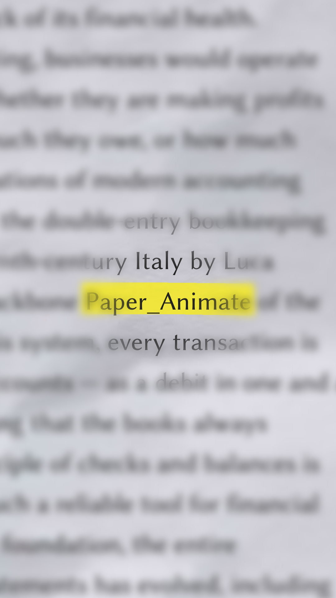
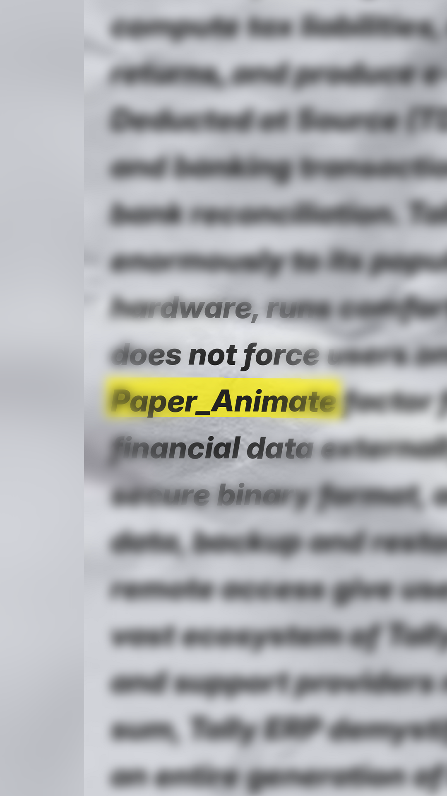
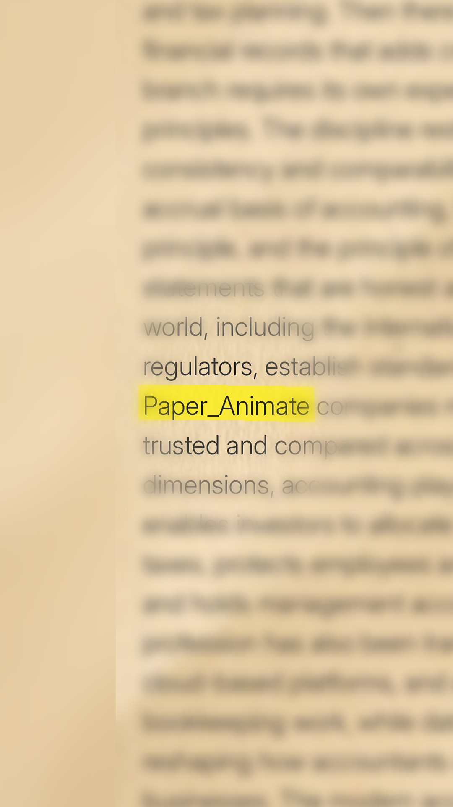
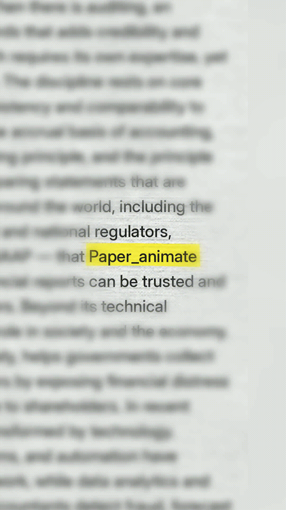

<p align="center">
  <h1 align="center">PaperAnimator</h1>
  <p align="center">A Python-based engine for generating stylized paper typography animations and videos.</p>
</p>

<p align="center">
  
  
  
</p>

## Overview

**PaperAnimator** is a Python-based generative design engine that creates visually striking typographic animations. It simulates printed text on textured paper with depth-of-field, randomized layouts, and realistic highlighter strokes.

Whether you're creating social media shorts, typography experiments, or dynamic storytelling videos, PaperAnimator handles text rendering, texture blending, blurring, and frame-by-frame assembly into a final MP4 video.

---

## Showcase / Demo

<p align="center">
  
  
  
</p>

<p align="center">
  
</p>

---

## Features

- **Dynamic Typography:** Pixel-aware word wrapping and automatic layout calculation.
- **Paper Textures:** Blends text naturally onto paper textures using soft overlays.
- **Realistic Highlighting:** Procedurally drawn, semi-transparent marker strokes with organic wobble.
- **Depth of Field Effect:** Advanced smoothstep radial blur that keeps the target word sharp while blurring the surroundings.
- **Video Assembly:** Compiles rendered frames into `.mp4` video automatically.
- **Multiple Aspect Ratios:** Built-in support for 9:16 (Shorts/Reels), 16:9, 1:1, and 4:5 formats.
- **Stable Alignment Engine:** Generates large source canvases and crops them to perfectly lock the target word to the center of the video (Module 2).

---

## How It Works

The system operates through modular processing pipelines:

**Pipeline Flow:**
`Asset Loading` &rarr; `Text Layout & Rendering` &rarr; `Highlighter & Blur Effects` &rarr; `Frame Alignment` &rarr; `Video Encoding`

- **`main.py`**: A standalone animation sequence generator focused on text positioning, layout variations, and scene transitions over paper backgrounds.
- **`module_1.py`**: The core rendering engine for single frames. It handles the complex logic for dynamic font sizing, text searching, marker stroke generation, and the radial Gaussian blur masking.
- **`module_2.py`**: The video orchestration layer. It utilizes `module_1` to generate large-scale source images, applies an affine transformation to lock the target text to a fixed center point, and compiles the sequence into a seamless video.

---

## Project Structure

```
paper_animation/
├── assets/                  # Required assets
│   ├── fonts/               # .ttf and .otf font files
│   ├── paper_textures/      # Background texture images
│   └── paragraphs/          # Text sources for rendering
├── output/                  # Generated frames and videos
├── samples/                 # Sample gallery outputs
├── main.py                  # Standard animation sequence generator
├── module_1.py              # Core rendering & effects engine
├── module_2.py              # Video orchestration & frame alignment
├── requirements.txt         # Python dependencies
├── .gitignore               # Git ignore rules
├── LICENSE                  # MIT License
└── README.md                # Project documentation
```

---

## Requirements

- Python 3.x
- `numpy==2.5.3`
- `opencv-python==5.0.0.93`
- `pillow==12.3.0`

---

## Installation

1. **Clone the repository:**
   ```bash
   git clone https://github.com/Tejas-Tripathi/paperanimator.git
   cd paperanimator
   ```

2. **Create and activate a virtual environment (Windows):**
   ```powershell
   python -m venv venv
   venv\Scripts\activate
   ```
   *(For Linux/macOS: `source venv/bin/activate`)*

3. **Install dependencies:**
   ```bash
   pip install -r requirements.txt
   ```

---

## Usage

### Running Module 2 (Video Generator)

To run the primary video generation pipeline, execute:

```bash
python module_2.py
```

The interactive script will prompt you to:
1. Select an aspect ratio (e.g., 9:16, 16:9).
2. Specify the number of frames to generate.
3. Enter the specific target text to be highlighted.

The system will first generate a few test frames and pause. You can check the `output/module_2_frames/` directory to ensure alignment is correct. Press `Enter` in the console to proceed with the full video generation. The final video will be saved as `output/module_2_output.mp4`.

---

## Configuration

Many aspects of the visual output can be tweaked directly in the source files. 

For example, in `module_1.py`:
- **Blur Configuration:**
  - `BLUR_ENABLED = True`
  - `BLUR_RADIUS = 12`
  - `FOCUS_RADIUS = 60`
  - `FEATHER_RADIUS = 250`
- **Highlight Configuration:**
  - `HIGHLIGHT_COLOR = "#FFF200"`
  - `HIGHLIGHT_OPACITY = 180`
  - `HIGHLIGHT_WOBBLE = 3` (controls the organic marker look)

---

## Customization

To customize the outputs, place your own assets into the respective `assets/` subdirectories:
- **Paper Textures:** Drop `.jpg` or `.png` textures into `assets/paper_textures/`.
- **Fonts:** Place `.ttf` or `.otf` files into `assets/fonts/`.
- **Paragraphs:** Add your own `.txt` text sources to `assets/paragraphs/`. The engine will randomly select and wrap these paragraphs around your target text.

---

## Development

To work on this project:
1. Follow the installation steps above.
2. The core rendering logic lives in `module_1.py` (specifically `draw_target_highlight` and `apply_radial_blur`).
3. Frame alignment and video compilation logic lives in `module_2.py`.
4. Currently, there is no automated test suite. You can run `module_2.py` to trigger the interactive test frame generation phase before a full render to manually verify changes.

---

## Contributing

1. Fork the Project
2. Create your Feature Branch (`git checkout -b feature/AmazingFeature`)
3. Test locally and verify the generated output.
4. Commit your Changes (`git commit -m 'Add some AmazingFeature'`)
5. Push to the Branch (`git push origin feature/AmazingFeature`)
6. Open a Pull Request

---

## Roadmap

*Future possibilities for the project:*
- External configuration file (JSON/YAML) to avoid hardcoding parameters.
- Support for custom audio tracks.
- More complex animation transitions between frames.
- CLI argument parsing to skip interactive prompts.
- Automated test coverage.

---

## License

PaperAnimator is released under the MIT License. See the [LICENSE](LICENSE) file for details.

---

[https://github.com/Tejas-Tripathi/paperanimator](https://github.com/Tejas-Tripathi/paperanimator)
